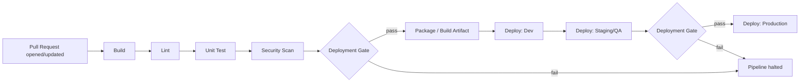
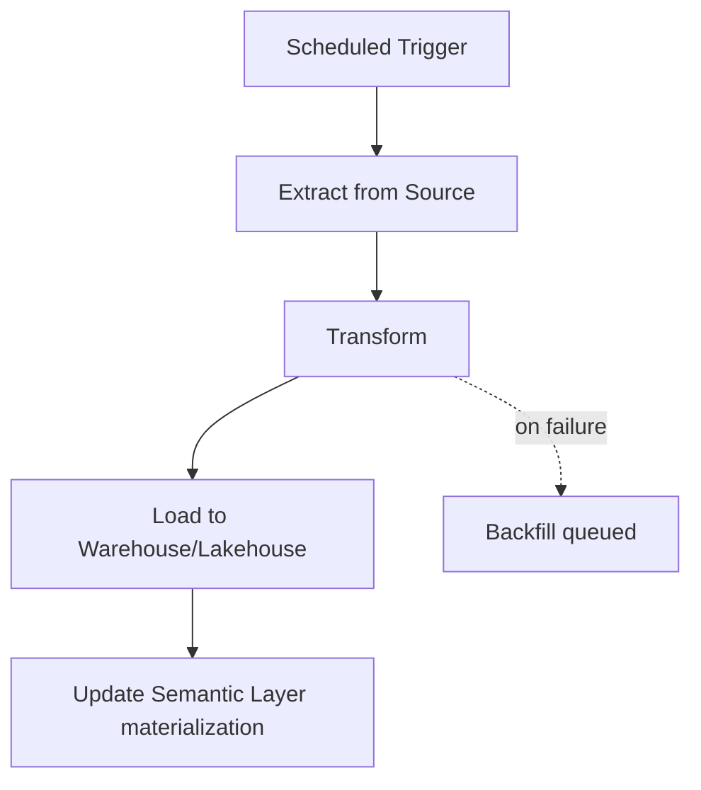
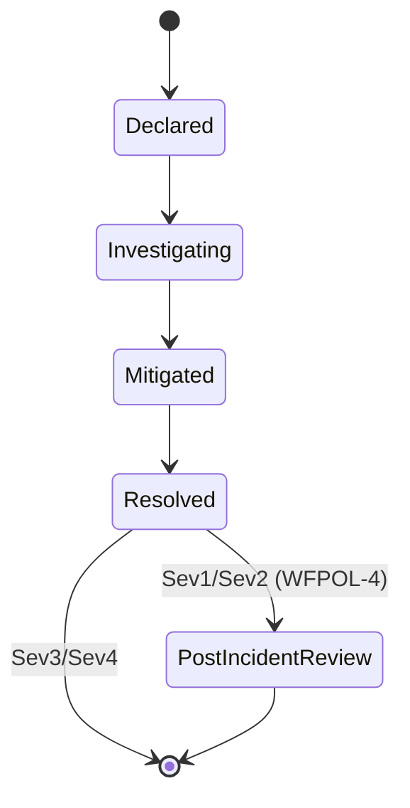

# Workflow/Process Domain — Conventions

Status: Draft — pending review
Ratified: No
Last updated: 2026-09-22
Provenance: see _qa/05-conventions.qa.md
Built on: 01-definitions.md, 04-metadata-standards.md

Scope: naming conventions for repositories, branches, and pipelines, plus
this domain's scaffolding diagrams — the visual counterpart to
Repository Scaffolding (`wf-repository-scaffolding`), Pipeline
(`wf-pipeline`), and DAG (`wf-dag`). Diagrams are authored as Mermaid,
embedded directly in this file: GitHub renders Mermaid natively, so
nothing here depends on an external tool or a generated image file, and
every diagram diffs and merges like the rest of this framework's plain
text.

---

## Repository Naming Convention

**Pattern:** `<domain>-<function>[-<type>]` — reuses System Architecture's
Service naming pattern (05-conventions.md there) exactly, since a
Repository's name typically matches the Service/Application it holds.

**Example:** `orders-api`, `billing-invoice-worker`

## Branch Naming Convention

**Pattern:** `<type>/<short-description>` where `<type>` is one of:

| Type | Use |
|---|---|
| `feature/` | New functionality |
| `fix/` | Bug fix |
| `release/` | Release Candidate preparation branch |
| `hotfix/` | Emergency fix, typically branched from a Release rather than the default branch |

**Example:** `feature/add-refund-flow`, `hotfix/payment-timeout`

## Repository Scaffolding — Standard Layout

```
<repository-root>/
├── src/                  # application/service source
├── tests/                # unit + integration tests (sysarch-unit-test, sysarch-integration-test)
├── .ci/                  # Pipeline Definition (wf-pipeline) — see CI/CD diagram below
├── infra/                # IaC (wf-iac) for this repository's own resources, if any
├── docs/
│   └── runbooks/         # Runbooks (wf-runbook) specific to this repository's service
├── CHANGELOG.md          # wf-changelog
└── README.md
```

Every new Repository is created from this scaffolding (or an
organization's own variant of it) rather than an ad hoc layout — the
mechanism `wf-repository-scaffolding --[produces]--> wf-repository`
(03-ontologies.md) describes.

## CI/CD Pipeline Flow



This is the generic shape every Pipeline (`wf-pipeline`) follows — each
box is a Pipeline Stage (`wf-pipeline-stage`), the diamond decision
points are Deployment Gates (`wf-deployment-gate`). The specific gates
enforced at each point are domain-specific (System Architecture's
SAPOL-4 test gate and SAPOL-3 secret scan, Data Platform's DPPOL-1
schema migration review where a Database is involved, Business
Intelligence / Reporting's BIPOL-1 certification check where a report
deploy is involved) — this diagram shows where they attach, not what
each one checks.

## Environment Promotion Flow


A Release Candidate (`wf-release-candidate`) becomes a Release
(`sysarch-release`) once it clears every gate on this path — same
mechanism 03-ontologies.md's `wf-release-candidate --[produces]-->
sysarch-release` relationship describes, shown here as a flow rather than
a single edge.

## Data Pipeline Orchestration — Example DAG



An illustrative DAG (`wf-dag`), not a template every Data Pipeline
(`dp-data-pipeline`) must follow — the actual step count/order is
pipeline-specific. Shown to make the DAG/Orchestration Engine
relationship (03-ontologies.md) concrete rather than purely abstract.

## Incident Lifecycle



Shows where Incident Severity (04-metadata-standards.md) determines
whether a Post-Incident Review (`wf-postmortem`) is required — the
branch this diagram shows is WFPOL-4's rule (06-policies.md), made
visual.

---

**Open items:**
- Branch type prefixes (`feature/`, `fix/`, etc.) are a common
  convention, not a universal one — an organization using a different
  Branching Strategy (e.g., pure trunk-based with no long-lived feature
  branches) may not need this table at all; flagged as illustrative, same
  posture used for medallion-layer naming in Data Platform.
- The CI/CD Pipeline Flow diagram shows two Deployment Gates (pre-package,
  pre-Production) as a representative default — an organization may have
  more or fewer per-environment gates; this diagram is the common shape,
  not a fixed requirement.

**Quality bar check (00-framework/quality-bar.md):**
- [x] Simple — two naming patterns, one scaffolding layout, four diagrams, each showing one concept
- [x] Modular — each diagram stands alone; none depends on another rendering correctly
- [x] Easy to update — Mermaid source is plain text, diffs like any other content in this repo
- [x] Easy to maintain — diagrams reference this domain's own anchors and other domains' policy IDs directly, so a rename is a find-and-replace, not a redraw
- [x] Easy to replace — no diagramming tool dependency beyond GitHub's native Mermaid rendering, which degrades gracefully to a visible code block if unsupported elsewhere
