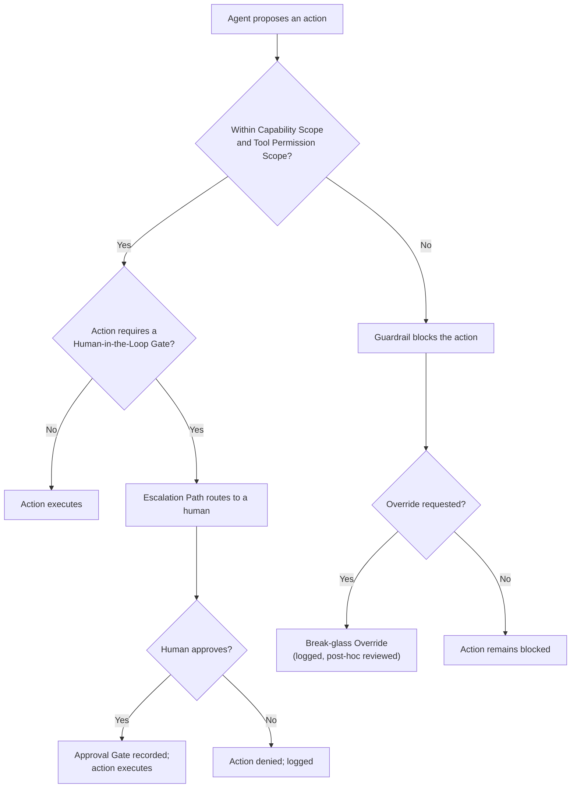

# Harness Domain — Conventions

Status: Draft — pending review
Ratified: No
Last updated: 2026-09-23
Provenance: see _qa/05-conventions.qa.md
Built on: 01-definitions.md, 04-metadata-standards.md

Scope: naming conventions for Agents and Model Version Pins, Prompt
Template versioning, and this domain's escalation-flow diagram — the
visual counterpart to Guardrail (`harness-guardrail`), Human-in-the-Loop
Gate (`harness-hitl-gate`), and Escalation Path (`harness-escalation-path`).
Diagram authored as Mermaid, embedded directly in this file, same
technique and rationale as Workflow/Process's 05-conventions.md.

---

## Agent Naming Convention

**Pattern:** `<owning-department>-<function>-<agent-type>` — mirrors
System Architecture's Service naming pattern, scoped by owning department
rather than domain since an Agent's Owning Team is often but not always
AI/ML Platform (`ccdept-ai-ml-platform`).

**Example:** `aiml-governance-builder-assistant`,
`platform-eng-incident-triage-autonomous`

## Model Version Pin Format

**Pattern:** `<provider>/<model-id>@<version-or-date>` — deliberately
provider-inclusive rather than provider-specific, consistent with this
domain's Standards Alignment note on staying vendor-agnostic.

**Example:** `anthropic/claude-sonnet-5@2026-09`

## Prompt Template Versioning

**Pattern:** Semantic Versioning (`sysarch-semver`), same reuse
Workflow/Process's Release Candidate/Changelog concepts already made —
a Prompt Template's version increments independently of its Agent's
Model Version Pin, since a template change and a model change are
distinct, separately-evaluable events (each requires its own Eval Suite
run per 06-policies.md's HPOL-2).

## Escalation Flow

**Reading the diagram:** the left branch (Guardrail block) and the right
branch (Human-in-the-Loop Gate) are independent checks, not sequential —
an action can fail the Capability Scope check without ever reaching a
Human-in-the-Loop Gate at all. Override/Break-glass (`harness-override`)
is reachable only from a Guardrail block, never used to skip a
Human-in-the-Loop Gate directly (see 06-policies.md's HPOL-5).

---

**Open items:**
- No naming convention is fixed for Guardrail/Content Filter rule sets or
  Eval Suite identifiers — left to Tooling (column 10), since these are
  typically platform-native identifiers rather than something this
  framework should prescribe a format for.

**Quality bar check (00-framework/quality-bar.md):**
- [x] Simple — 3 naming conventions, 1 diagram
- [x] Modular — independent of every other domain's conventions
- [x] Easy to update — Mermaid source is plain text, diffable
- [x] Easy to maintain — diagram renders natively on GitHub, no generated image file to regenerate
- [x] Easy to replace — no model provider or tooling vendor named as the convention itself
